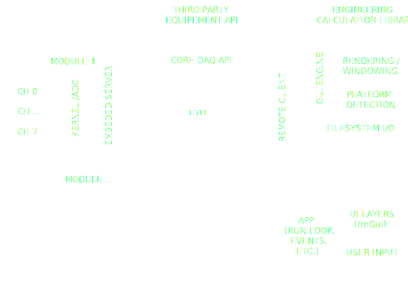

# WALLACE INSTRUMENTS: VENTURI REAL TIME DATA AQUISITION

***this is very much a work in progress***

WI Venturi is inteded to be a client application for streaming realtime data from an aribitrary number of data aquisition module (DAQ modules) and plotting and processing the data in real time. 

The WI-Venturi application is using the [WI-Oak](https://github.com/csooriyakumaran/oak) library to build the GUI using GLFW, OpenGL3, ImGui and ImPlot. Oak engine handles all the backend stuff like creating windows, imgui panels, handling events, etc. and links with the application project as a static library. 

Venturi will eventually interface with a remote server (TBD) which will handle all connections to the WI DAQ modules, and any third-party DAQ modules, as well as a library (TBD) for performing engineering calucations like FFT signal processing, and typical calculations and calibrations for aerodynamic measurements like pneumatic pressure measurements, hotwire turbulence measurements, and accoustic measurements.  

The UI elements are defined by subclassing the Oak::Panel class and implementing at least the OnUIRender(bool* p_open) and SetLocalStyle() member functions, and pushing these panels onto the UI layer's Oak::PanelStack. The UI layer's own OnUIRender() will iterate through the panels on the stack and call the panel's SetLocalStyle(), and OnUIRender(bool* p_open). p_opem is a pointer to a boolean which controls whether or not the panel is visible. ImGui can toggle this boolean when a panel is hidden by the user. 

Below is the proposed architecture for the WI DAQ Software. 

Building Venturi
---
on your first build of venturi, do the following [windows only for now]:

    $ git clone --recursive https://github.com/csooriyakumaran/venturi

    $ git submodule update --remote (might not be necessary)

    $ scripts/setup.bat

setup.bat will generate a MS Visual Stuido 2022 solution project which when built will compile all submodules and dependencies, and link them to the venturi app executable. 

to pull latest changes

    $ git pull origin master

    $ git submodule update --remote

To Do:
---
- [x] 1. 